# Network Service - UI Support

⚠️ Work In Progress - Page under construction ⚠️

The UI can be used in addition to the kubectl and API support available in CCI.

The UI allows users to execute all necessary workflows:
- Services
    - List all Services
        - See summary of the service
        - See details for the service
    - Action
        - View the YAML for a service
- List all VM Load Balancers
    - List all Load Balancers
        - See summary of the Load Balancer
        - See details for the Load Balancer
    - Action menu bar
        - Create a new Load Balancer
    - Grid action menu
        - View the YAML for a Load Balancer
        - Delete a Load Balancer
        - Edit a Load Balancer

## List all Services

List of available Network Services. You can deploy and manage services in a self-service way using Kubernetes APIs.

Users can view all the Network Services created in the namespace. The user will see the following information in the grid's default view:
- Name
- Type
- Cluster IP
- External IP
- Ports
- Age

There are additional columns that can be toggled through the Manage Columns button located at the bottom of the grid:

- Labels - any labels assigned to the service
- Created On - specific time the service was created

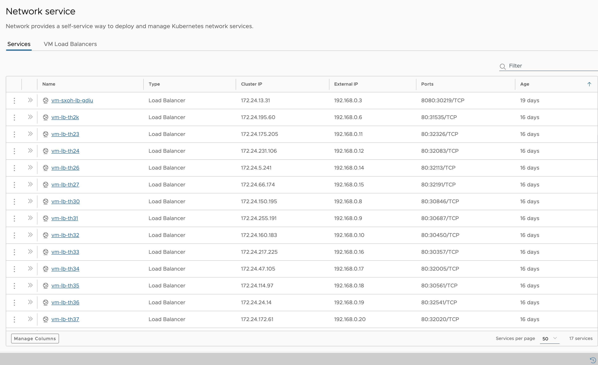

### Summary of Network Services

Click on the double chevrons to see key information for the resources.

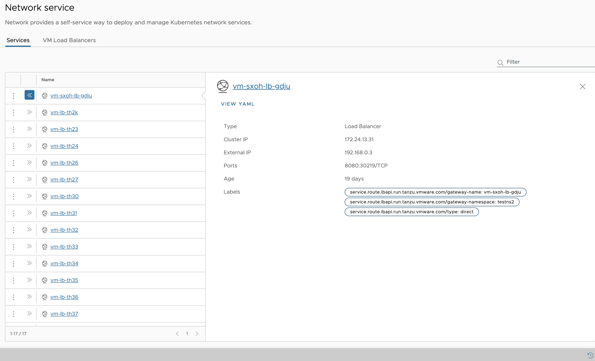

### Details of Network Services

Click on the Service name to see all the details for the resource, including recent events.

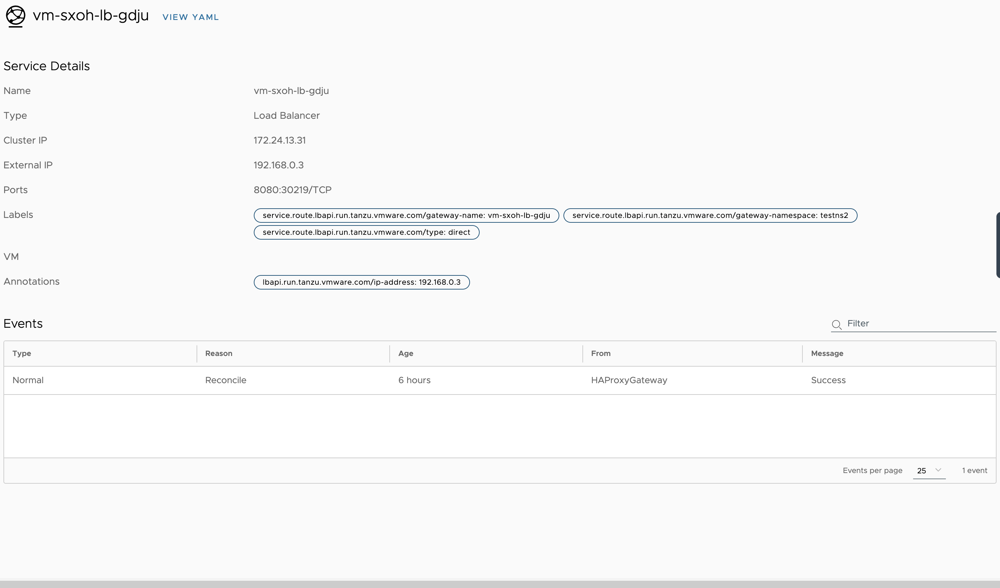

### Action Menubar
#### View YAML

To view the resource YAML in the YAML Explorer panel at bottom.

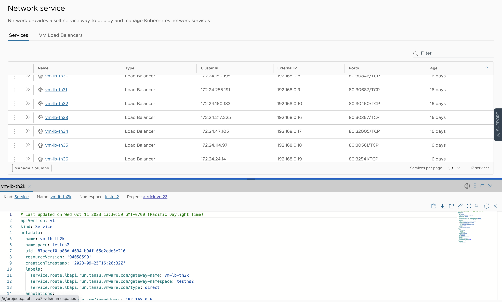

## List all VM Load Balancers

List of available Network Services. You can deploy and manage service in a self-service way using Kubernetes APIs.

Users can view all the Network Services created in the namespace. The user will see the following information in the grid's default view:
- Name
- Selector

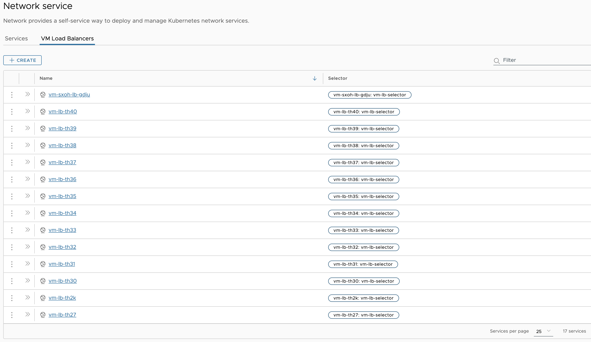

### Summary of Network Services

Click on the double chevrons to see key information for the resources.

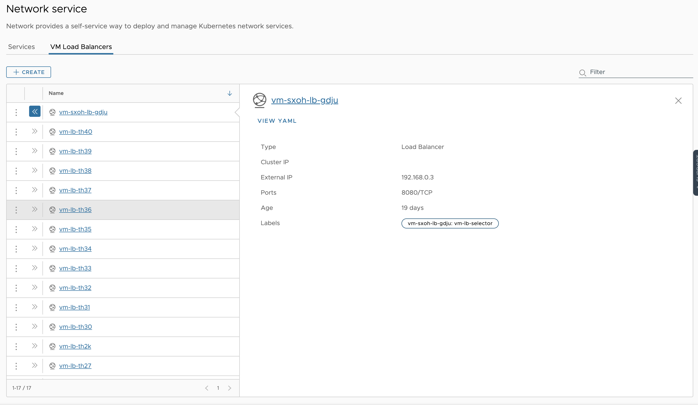

### Details of Network Services

Click on the Service name to see all the details for the resource, including recent events.

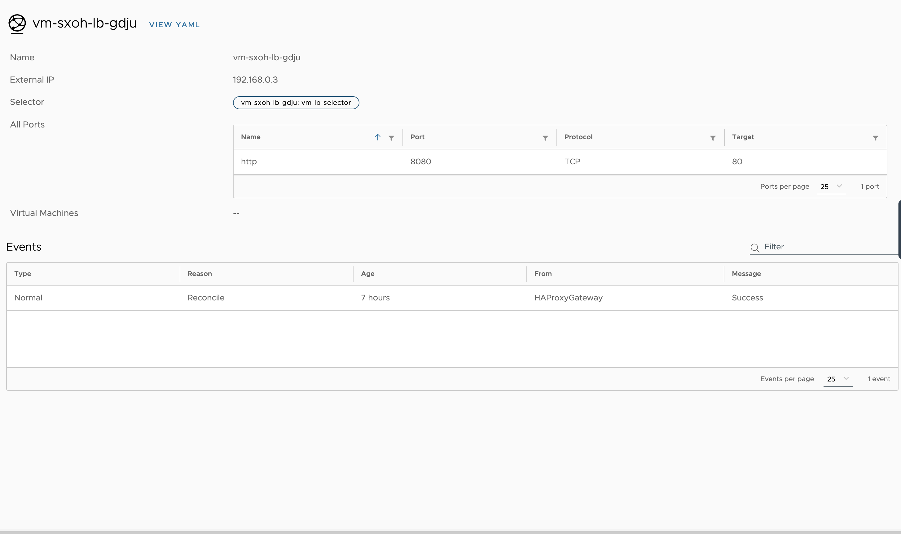

### Action Menubar
#### Create

Create VM Load Balancer workflow.

On Create button click VM Load Balancer model open with pre-populated name. 
We are able to edit the name, depend on the name 'Selector' value get populated.

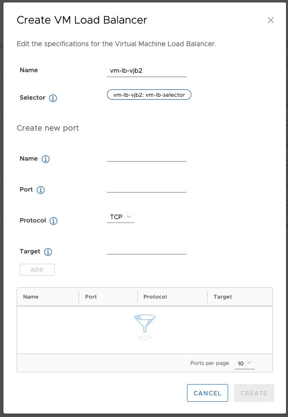

##### Create new port

To add new port to port group. THe user will enter following required fields and click Add button.
- Name
- Port
- Protocol
- Target

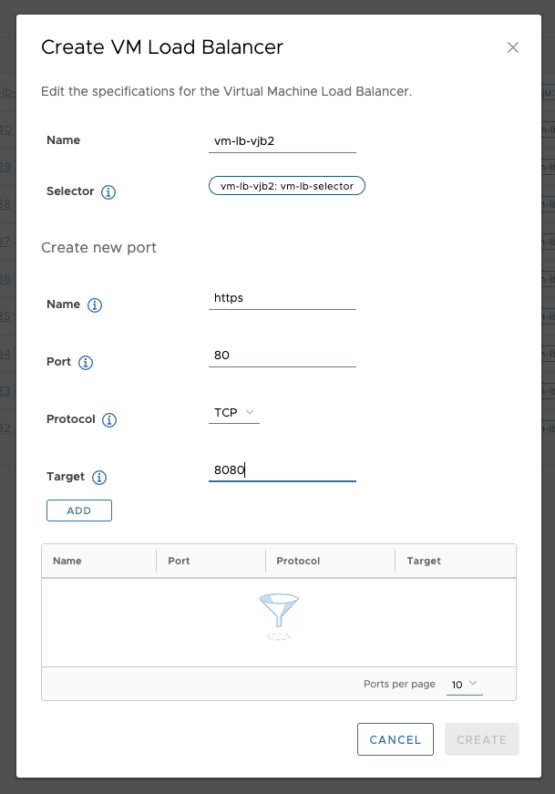

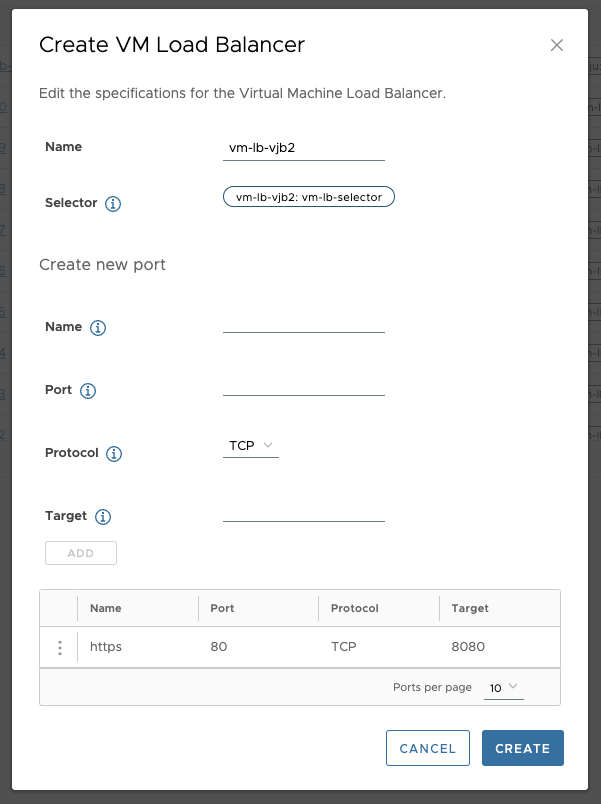

### Action Menubar

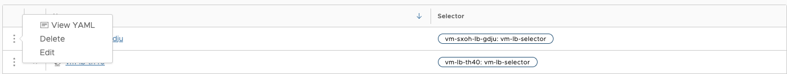

#### View YAML

To view the resource YAML in the YAML Explorer panel at bottom.

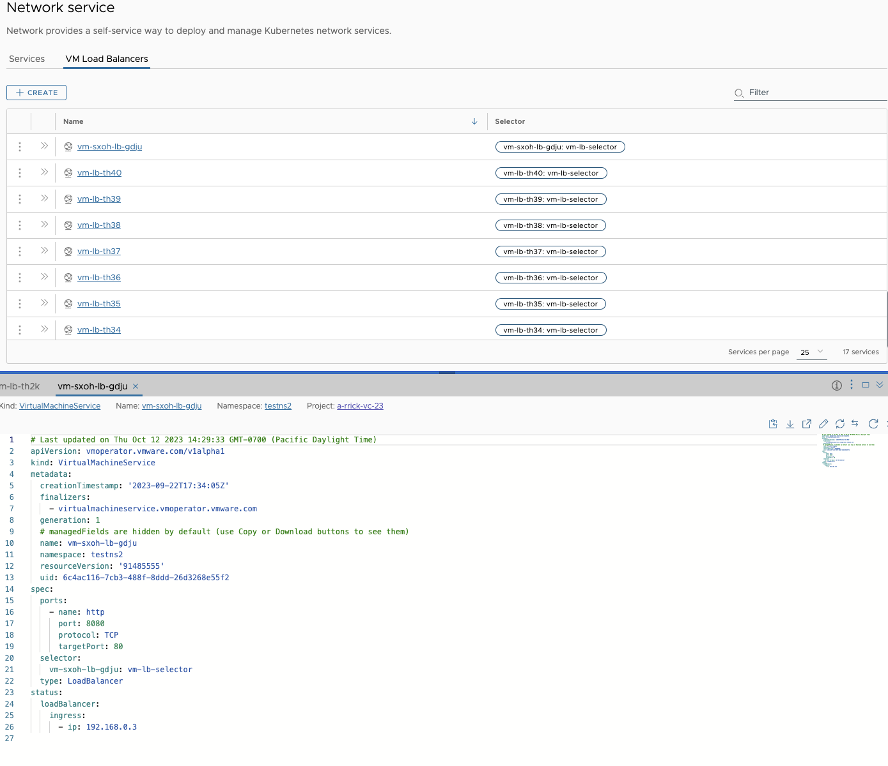

#### Delete

Show Delete confirmation popup

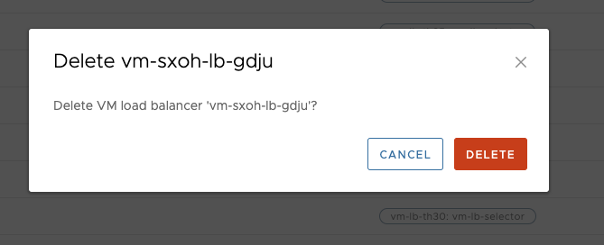

#### Edit

Show edit VM LB popup to add / remove port

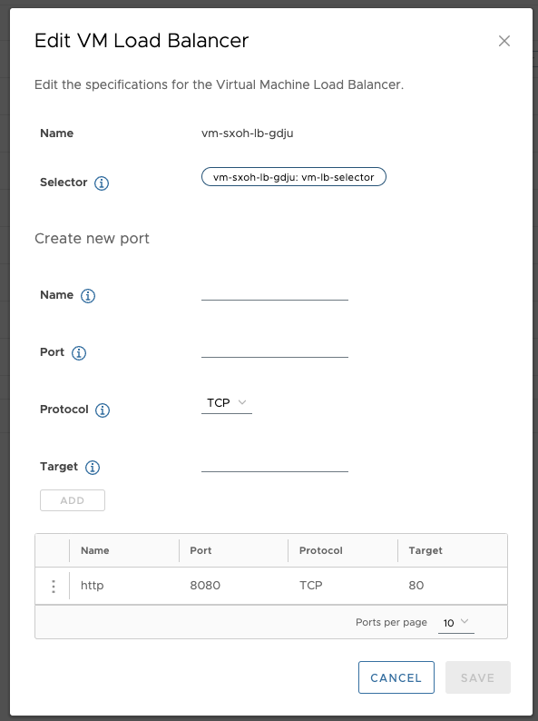
