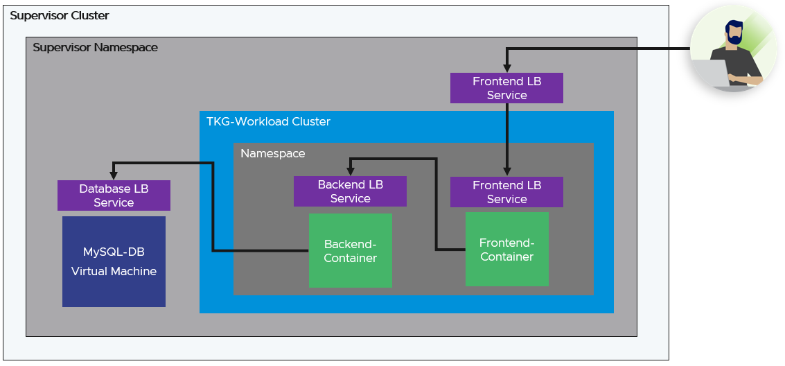

# Deploying a 3 Tier Application using TKG and VM Service
Many modern applications consist of a containerized part of the application stack that still has a dependency on data services that are better suited to VM based form factors then containers. In this solution, we will take a look at deploying a VM based MySQL database that will be accessed by a API server (backend). A consumer will access the application using a the UI (frontend), both the backend and frontend applications will be running as containers inside of a Kubernetes cluster. 

*All yaml files can be found in the codeSamples directory.*

## Prerequisites
* Access to a Supervisor Namespace
* Supervisor Namespace with bound Storage Classes and VM Classes
* Compatible Tanzu Kubernetes Release in bound Content Library
* VM Image (ubuntu-20-1633387172196) stored in a bound Content Library

## Deployment Diagram


## Components
- VM Service VM running MySQL 8
    * VM Configuration - includes cloud-int
    * VM Service Loadbalancer - exposing port 3306 and port 22
- TKG Cluster
    * backend-application (API)
        * Secret containing mysql connection details (host,user,db_name,password)
        * Loabbalancer Service exposing port 5000
        * Deployment for 1 pod running the API server
    * frontend-application (UI)
        * Secret containing API Service IP:Port
        * Loabbalancer Service exposing port 5000
        * Deployment for 1 pod running the GUI

## Deploying the Database VM
1. Login to the Supervisor using `kubectl vsphere login -s <CP_VM_IP>`

2. Check storage class name `kubectl describe ns <YOUR_NAMESPACE>`

3. Identify the storage class name from the resource quotas section (see example)
    ```
    Resource Quotas
    Name:                                                                     developer-utilities-storagequota
    Resource                                                                  Used  Hard
    --------                                                                  ---   ---
    vsan-default-storage-policy.storageclass.storage.k8s.io/requests.storage  0     9223372036854775807
    wcpglobal-storage-profile.storageclass.storage.k8s.io/requests.storage    0     9223372036854775807
    ```

4. Get the VM Class available in your Supervisor Namespace `kubectl get vmclass -n <YOUR_NAMESPACE>` (see example)
    ```
    NAME                 CPU   MEMORY    AGE
    best-effort-small    2     4Gi       7d2h
    best-effort-medium   4     8Gi       7d2h
    best-effort-large    4     16Gi      7d2h
    ```

5. Capture the desired storage class and VM class
    ```
    STORAGE_CLASS: vsan-default-storage-policy
    VM_CLASS: best-effort-small
    ```
6. Get the VM Images available in your Supervisor Namespace `kubectl get virtualmachineimages -n <YOUR_NAMESPACE>`
    ```
    NAME                                                        CONTENTSOURCENAME                      VERSION                          OSTYPE                FORMAT   AGE
    ob-19930037-photon-3-k8s-v1.22.9---vmware.1-tkg.1.cc71bc8   226a0b09-167d-49cf-b36a-4b2cb6e519c9   v1.22.9+vmware.1-tkg.1.cc71bc8   vmwarePhoton64Guest   ovf      8d
    ubuntu-20-1633387172196                                     81747b37-03b5-4936-98d3-f5032315bfdc                                    ubuntu64Guest         ovf      4m22s
    ```

7. Base64 encode the mysql_config and add it to the user-data field in the mysql-db-cm ConfigMap (mysql-vm.yaml) `cat mysql_config.yaml | base64 -w0`

8. Update mysql_vm.yaml to leverage the storage class and vm class listed above (mysql-vm.yaml).

9. Deploy the MySQL Database VM  `kubectl apply -f mysql_vm.yaml -n <YOUR_NAMESPACE>`


## Deploy TKG Cluster:

1. Update the tkg.yaml file to use the correct tkr, storageClass, and vmClass.

2. Deploy the TKG cluster `kubectl apply -f tkg.yaml -n <YOUR_NAMESPACE>`

3. Use `kubectl watch tkc tkc-workload-cluster -n <YOUR_NAMESPACE>` to track when the cluster is ready. 

## Deploy Frontend and Backend containers

Note: There are 3 additional fields in the backend-app-secret that contain values associated with the MySQL Database. Only change them if you made an update to the MySQL Database or the mysql-config.yaml.

1. Get the mysql-db LoadBalancer External IP `kubectl get service mysql-db -n <YOUR_NAMESPACE>`

2. Base64 encode the external IP address and add it to the 'backend-app-secret' for the mysql_host field (backend-app.yaml) `echo -n "192.12.34.6" | base64 -w0`

3. login to the TKG Cluser 'kubectl vsphere login --server <CP_VM_IP> -u <USER_NAME> --tanzu-kubernetes-cluster-name workload-cluster --tanzu-kubernetes-cluster-namespace <YOUR_NAMESPACE> --insecure-skip-tls-verify`

4. Select the TKG cluster context `kubect config use-context workload-cluster`

5. Apply the Pod Security Policy `kubectl apply -f pod-security-policy.yaml`

6. Create a namespace `kubectl create ns app-ns`

7. Deploy the Backend Container `kubectl apply -f backend-app.yaml -n app-ns`

8. Wait for the Backend application pod to be started `watch kubectl get pods -n app-ns`

9. Once Backend applicaiton pod is started, get the external IP from the backend-app-service `kubectl get service -n app-ns`

10. Test backend application `curl -X GET <EXTERNAL-IP>:5000/api/index`, one entry should be returned.

11. Base64 encode the external IP address and port 5000 from above and add it to the 'frontend-app-secret' for the api_url field (frontend-app.yaml) `echo -n "187.12.34.5:5000" | base64 -w0`

12. Deploy the Frontend-application `kubectl apply -f frontend-app.yaml -n app-ns`

13. Wait for the frontend application pod to be started `watch kubectl get pods -n app-ns`

14. Once frontend applicaiton pod is started, get the external IP from the frontend-app-service `kubectl get service -n app-ns`

15. Copy the external IP address and add port 5000 `Example: 192.26.35.25:5000 and paste into your browser. You will be directed to the Home page of the application. 


