# Tanzu Kubernetes Cluster Supervisor Service

⚠️ Work In Progress - Page under construction ⚠️

This is the Service overview page for the Tanzu Kubernetes Cluster service. This is where the summary would go  

## API reference

[TKG API Reference](http://developers.eng.vmware.com/apis/iaas/)

## Support
* Only support v1 API
* Something else

## Tutorials
[This would be one example tutorial](#this-would-be-one-example-tutorial) - [***(Video Tutorial)***](#demo-video-for-this-example)

[Another example tutorial](#another-example-tutorial)

## This would be one example tutorial

This would be a summary of what this tutorial covers, example deploy a vm.....

#### Demo Video for this example

[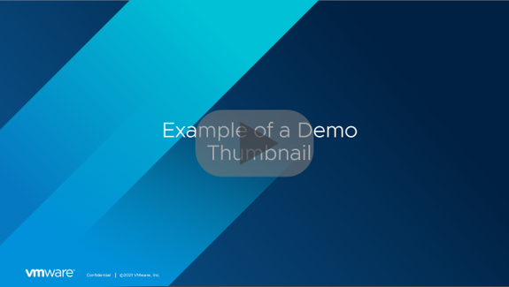](https://www.youtube.com/)

## Another example tutorial
1. Configure something
2. Deploy TKG
3. Scale TKG
4. Add Proxy

# Tanzu Kubernetes Grid Service - UI Support

The UI can be used in addition to the kubectl and API support available in CCI.

The UI allows users to execute all necessary workflows:
- List all Clusters
    - Show summary of cluster
    - Show details of cluster, including editing the cluster, health status, and recent events
- Action menubar
    - Create a new cluster (Default and Custom configuration)
- Grid action menu
    - View the YAML for a cluster
    - Delete a cluster

## List all Clusters

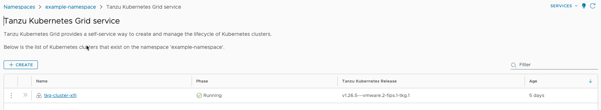

## Summary of a cluster

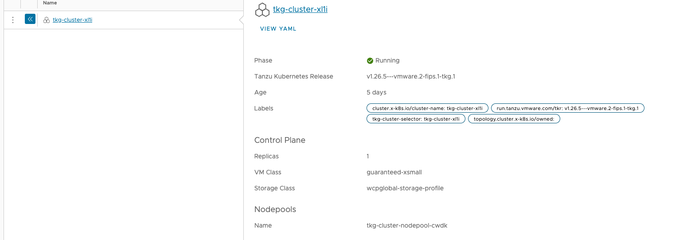

## Details of a cluster

The details page provides all the information related to the cluster. The user has the option
to edit some settings for the cluster, including:
- Control Plane - Number of replicas and the VM Class
- Nodepools - Number of replicas, VM Class, and adding or editing Volumes

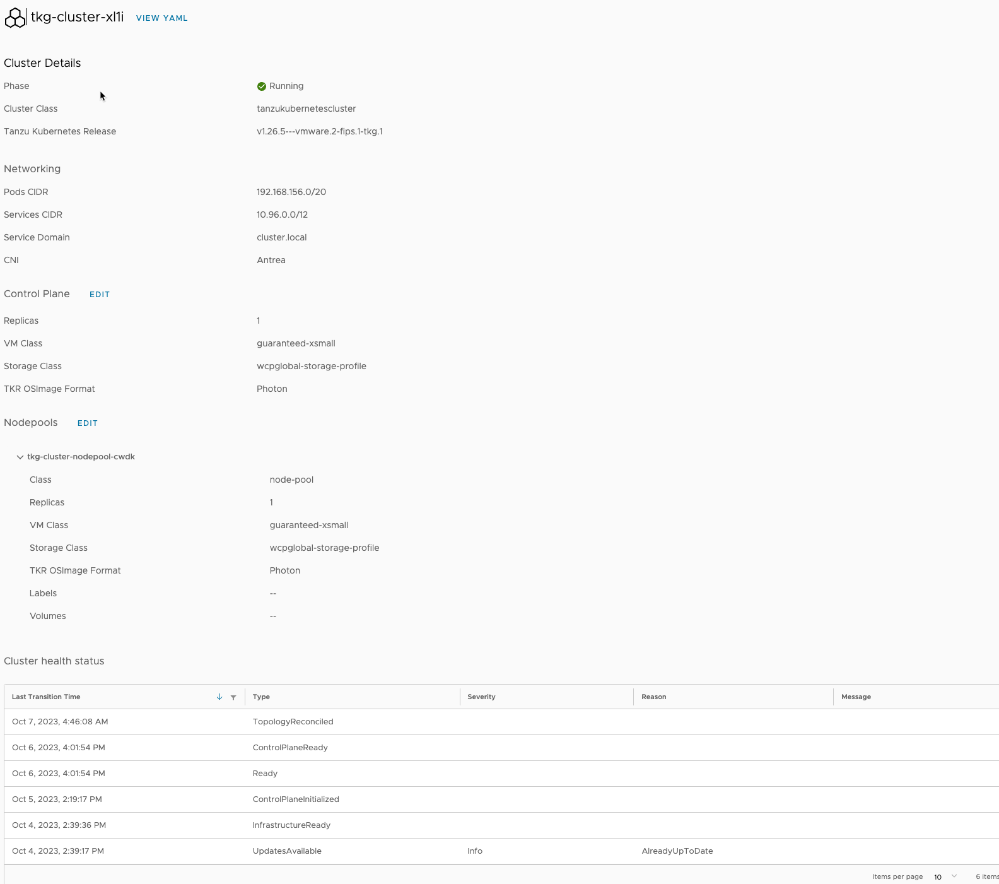

## Actions

There is a single action available in the list view. The Create button provides two options for creating Tanzu Kubernetes Clusters. You can create clusters with Default settings or customize the cluster's settings. Only VMware provided Cluster Class is supported to customize the cluster.

### Create a new cluster - Default configuration

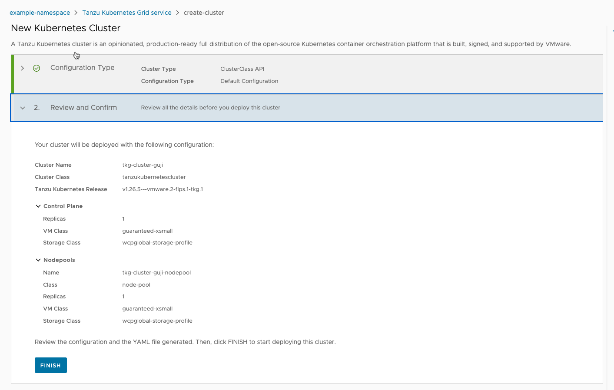

### Create a new cluster - Custom configuration

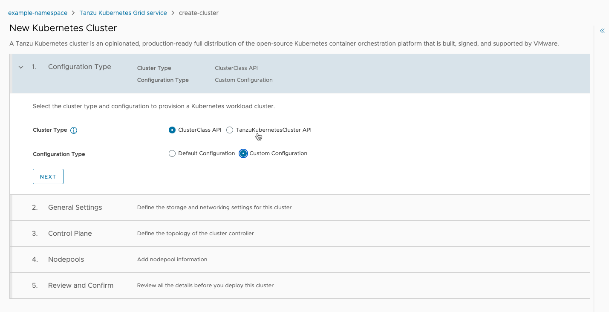

Once you have selected to create a custom cluster, you will need to navigate through the wizard.

For the General Settings section, you can accept all the defaults or override one or more fields.

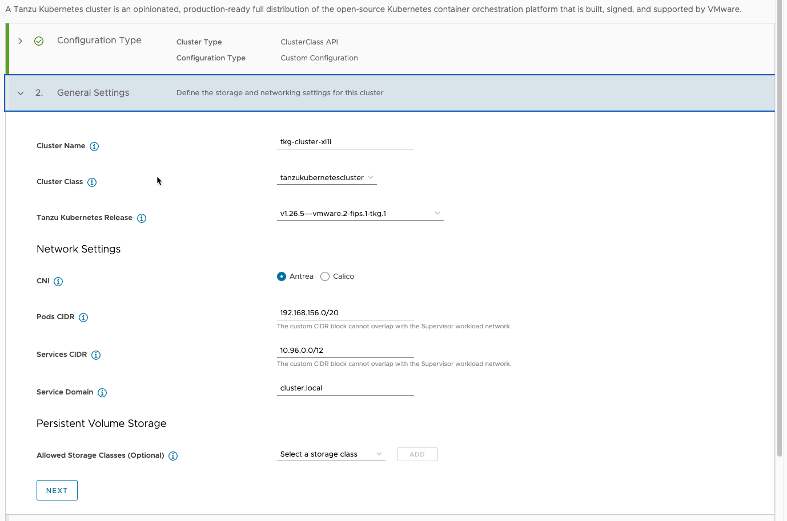

Next configure the settings for the Control Plane.
- Number of Replicas - how many control plane VMs do you want to configure (1 or 3)
- VM Class - the amount of resources to allocate to each control plane VM
- Storage Class - the storage class to use for any volumes created
- TKR OSImage Format - select Photon or Ubuntu
- Volumes (optional) - add any additional volumes you want available in the control plane
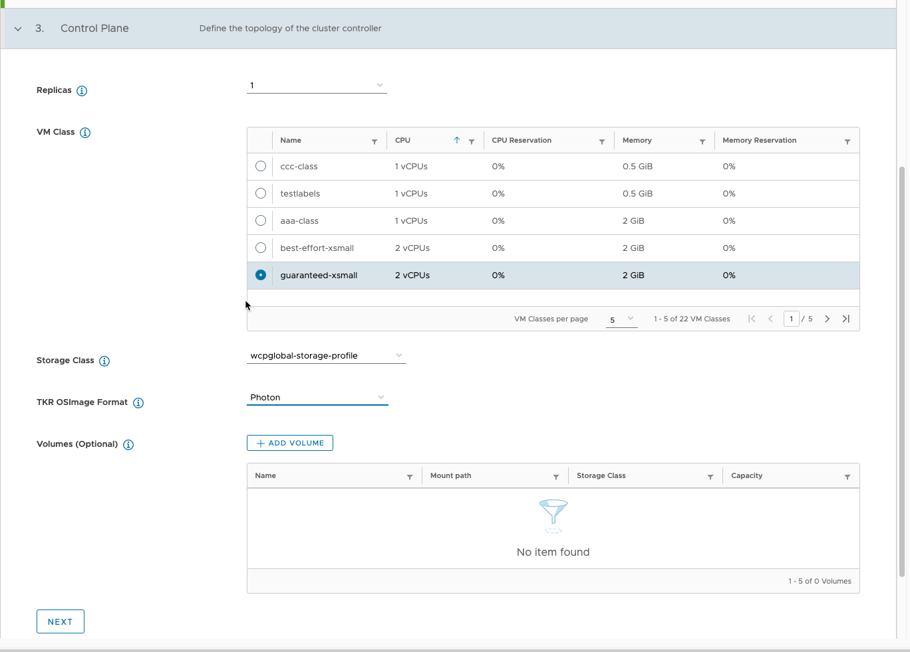

You must configure at least one nodepool. 
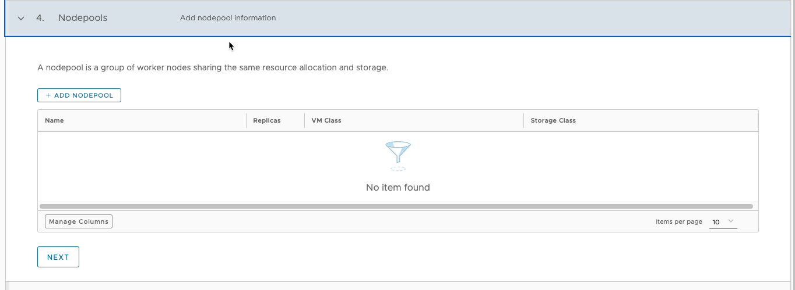

When configuring a nodepool, you must at least specify the TKR OSImage format. All other fields are defaulted but can be overridden.

- Name
- Class
- Replicas
- VM Class
- Storage Class
- TKR OSIMage Format
- Labels
- Volumes - if you choose to add volumes to the nodepool, an additional step is added to the wizard to allow customization of volumes.

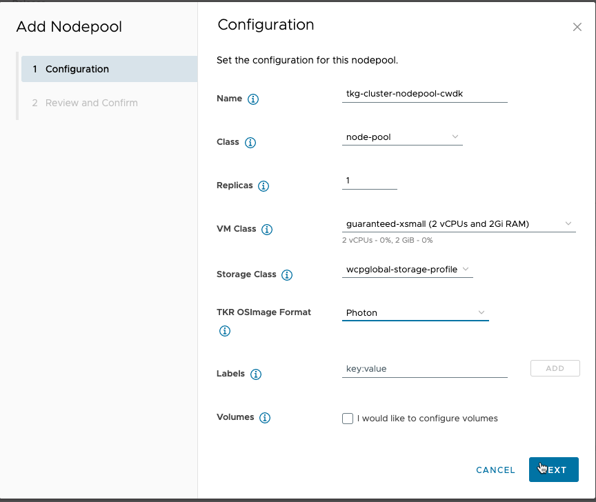

Review the details of the Nodepool configuration and confirm.

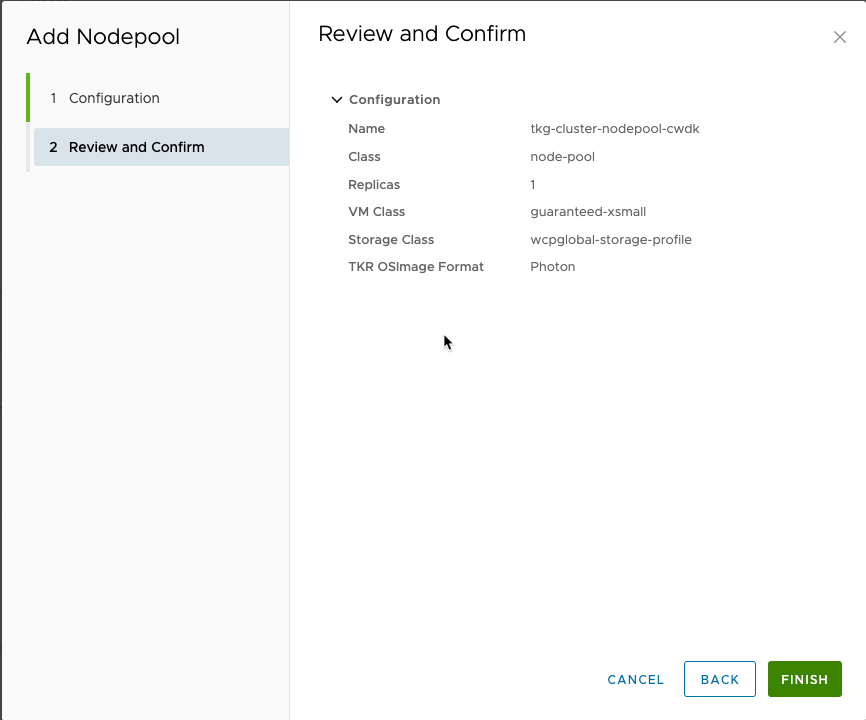

Click on Next once you are done with Nodepool configuration.

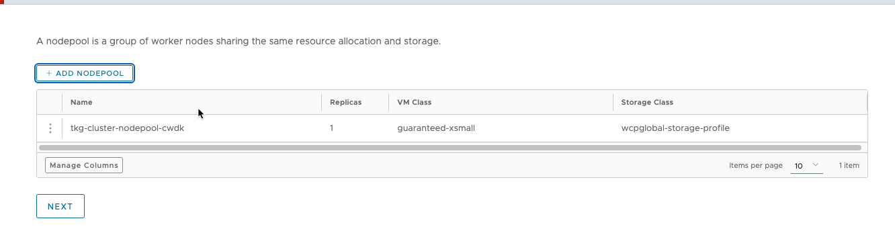

Review the details of the cluster configuration and click FINISH to create your cluster.

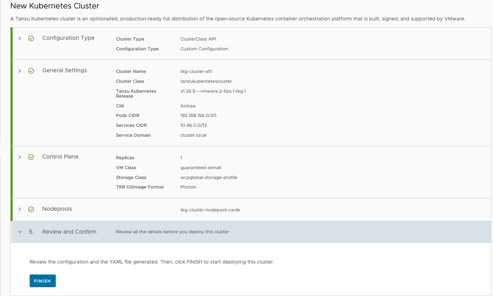

### Grid action menu

There are two actions available from the grid menu.
1. Viewing the YAML for the resource
2. Deleting the Cluster

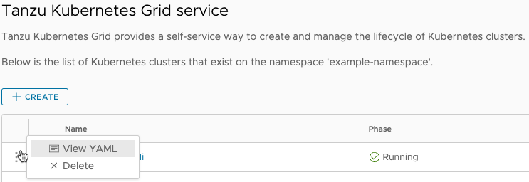
