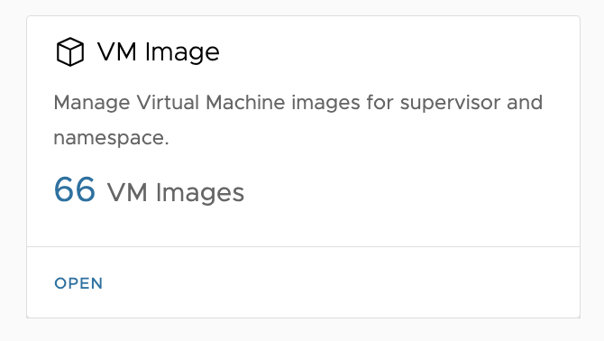
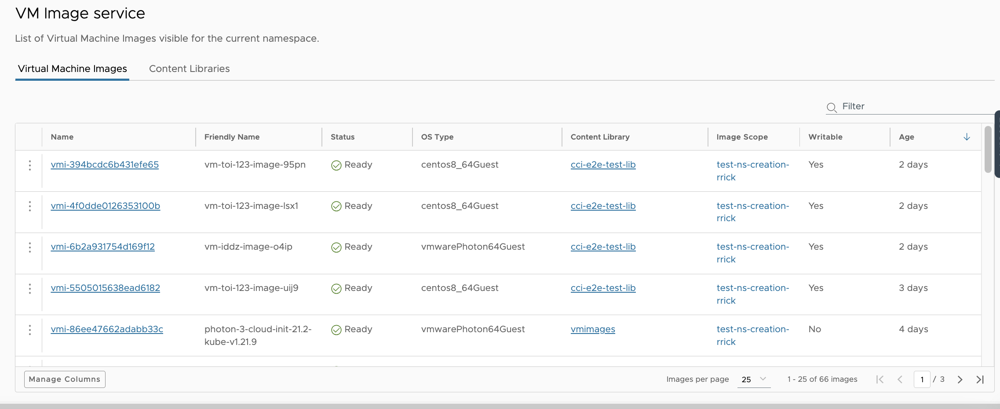
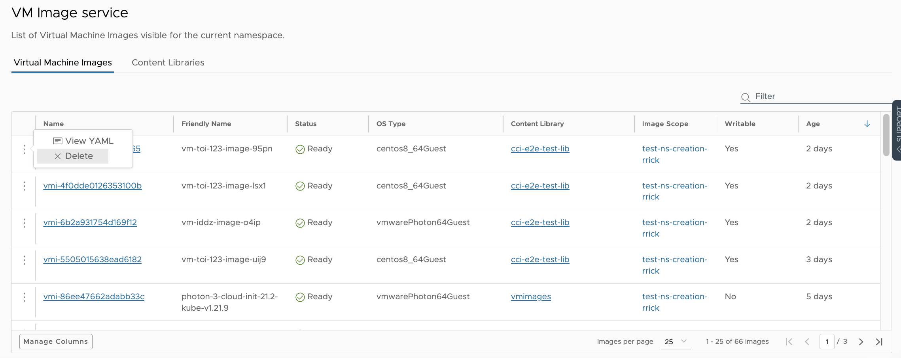
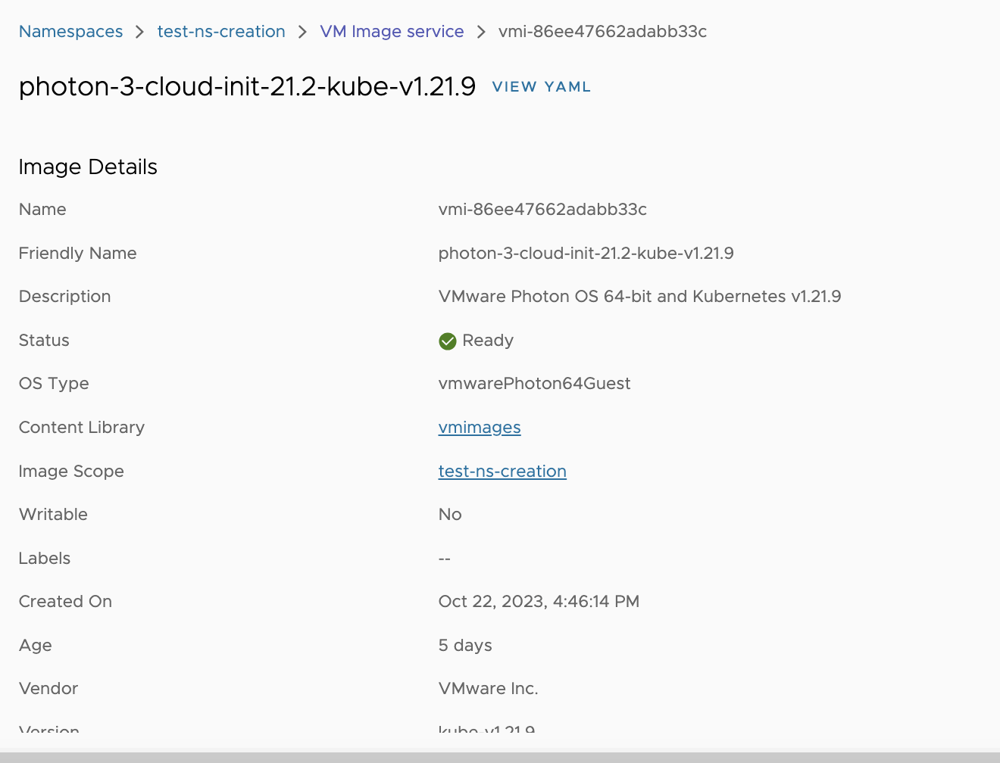
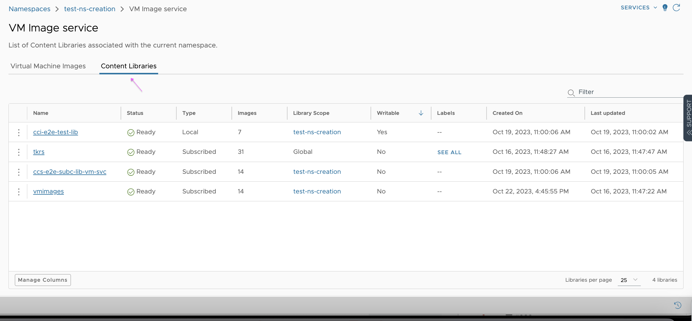
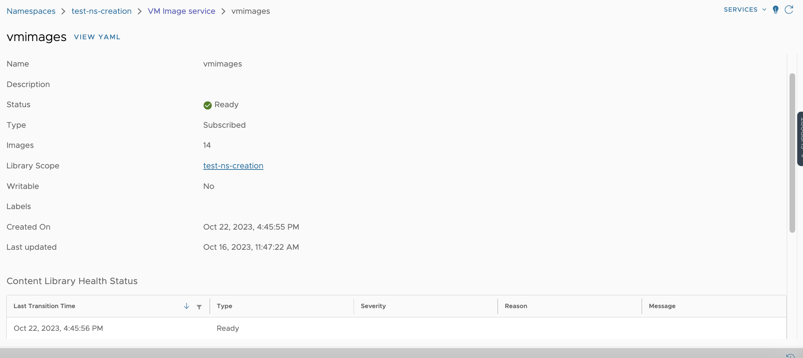

# Virtual Machine Image Supervisor Service

⚠️ Work In Progress - Page under construction ⚠️

This is the overview page for the Virtual Machine Image service. 

[VM Service API Documentation](http://developers.eng.vmware.com/apis/iaas/)

## Support
* Only support v1 API
* Below mentioned features are only available on namespaces backed by vCenter 8.0 Update 2 release and above.

# Virtual Machine Image Service - UI Support

The UI can be used in addition to the kubectl and API support available in CCI.

The UI allows users to execute all necessary workflows:
- Types of Content Libraries and VM Images
    - Global scoped 
    - Namespace scoped
- Virtual Machine Images
    - List all Virtual Machine Images
        - Show details of image
    - Grid action menu
        - Delete an image from a Content Library
        - View the YAML for an image
- Content Libraries
    - List all Content Library contents
        - Show details for the Content Library
    - Grid action menu
        - View the YAML for a Content Library
- Publish VM to a Content Library

## Types of Content Libraries and VM Images
### Global scope
- Content Libraries can be associated with a supervisor cluster. Such libraries are considered **global scoped libraries**.
- All VM Images within such libraries are considered global scoped images.
- Libraries/images which are global scoped are read-only for CCI users. VI admins are responsible for managing these libraries/images.
- Publishing a VM to a global scoped library is not allowed for CCI users.
- Global scoped libraries are available/visible to all namespaces under the supervisor.

### Namespace scope
- Content Libraries can be associated with a namespace. Such libraries are considered **namespace scoped libraries**.
- All VM Images within such libraries are considered namespace scoped images.
- Libraries/images which are namespace scoped are read-only by default. The VI/Cluster Admin can modify a "local" Content Library to become writable.
- Publishing a VM to a namespace scoped library is allowed for CCI users only if the library has been made writable.

## List all Virtual Machine Images
 
VM Image service can be accessed via a card on the namespace summary view. If VM Image service is available for the current namespace then the above shown card will appear in the namespace summary view. Check out the support section in this document. 

In the above picture, we are looking at the list of VirtualMachine Images which are available for the current namespace. Namespaces are not directly associated with VM Images rather transitively associated through Content Libraries. The above list view is an aggregation of all the VM Images across all Content Libraries that are associated with the current namespace. 

### Actions

The only user action available for consumption users to perform on a VM Image is "Delete" a VM Image from a [namespace scoped](#namespace-scope) Content Library that has been marked as writable. Delete action will be unavailable for VM Images which belong to [global scope](#global-scope) and read-only libraries. 

### Details

Clicking an image name in the VM Image list view will navigate to a detailed summary view for the selected VM Image. On this view, you will be able to view all the details of VM Image, check health status, and view the list of latest Kubernetes events for the given image. 

## List all Content Library resources

Content Library list view displays the list of Content Library resources associated with the current namespace. There are two kinds of library resources with regards to the scope: [*global scoped and namespace scoped*](#types-of-content-libraries-and-vm-images). 

- **Global scoped** library is available for the namespace at the Supervisor level. In other words, a global scoped library is common to all the namespaces under a Supervisor. 
- **Namespace scoped** libraries are associated with a particular namespace by the VI Admin. This kind of library resource is by default **read-only** and can be made **writable** by the VI Admin. 

### Actions
*Consumption users do not have the privileges to perform mutation operations on a Content Library resources, with the exception of Publishing a VirtualMachine to a writable Content Library.* 

### Details

Clicking a name in the Content Library list view will navigate to a detailed summary view for the selected Content Library resource. On this view, you will be able to: view all the details of the Content Library resource, check health status, and view the list of latest Kubernetes events for the given library resource. 

## Publish VM to a Content Library
The overlap between VM Service and VM Image Service is the available VM Publish action on VMs. VMs can be published to a Content Library to be saved as VM Templates. Below link will provide more information about the VM Publish feature.
[Publish VM](../vm-service/README.md#grid-action-menu) 