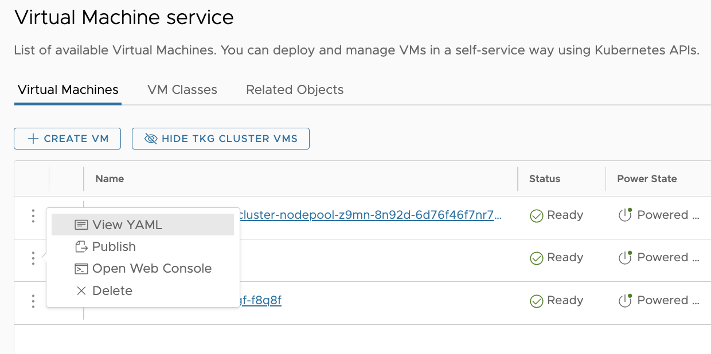
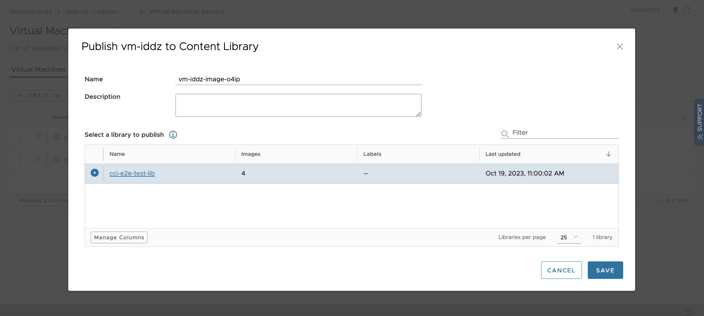

# Virtual Machine Supervisor Service

⚠️ Work In Progress - Page under construction ⚠️

This is the overview page for the virtual machine service. This is where the summary would go  

[VM Service API Documentation](http://developers.eng.vmware.com/apis/iaas/)

## Support
* Only support v1 API
* Something else

## Tutorials
[This would be one example tutorial](#this-would-be-one-example-tutorial) - [***(Video Tutorial)***](#demo-video-for-this-example)

[Another example tutorial](#another-example-tutorial)

## This would be one example tutorial

This would be a summary of what this tutorial covers, example deploy a vm.....

#### Demo Video for this example

## Another example tutorial
1. Configure something
2. Deploy secret
3. Deploy config-map
4. deploy VM object

# Virtual Machine Service - UI Support

The UI can be used in addition to the kubectl and API support available in CCI.

The UI allows users to execute all necessary workflows:
- Virtual Machines
    - List all VMs
        - Show summary of VM
        - Show details of VM, including editing the VM, health status, and recent events
        - Toggle display of TKG Cluster VMs
    - Action menubar
        - Create a new VM (Default and Advanced configuration)
        - Toggle display of TKG Cluster VMs
    - Grid action menu
        - View the YAML for a VM
        - Publish a VM
        - Open Web Console
        - Delete a VM
- VM Classes
- Related Objects

## Virtual Machines

### List all VMs

List of available Virtual Machines. You can deploy and manage VMs in a self-service way using Kubernetes APIs.

Users can view all the VMs created in the namespace. The user will see the following information in the grid's default view:
- Name
- Status (Ready, Error, etc.)
- Power State (On/Off)
- Address : IP address
- VM Image
- VM Class
- Age : How long the VM has existed

There are additional columns that can be toggled through the Manage Columns button located at the bottom of the grid:

- Managed by - which TKG Cluster does this VM belong to
- Labels - any labels assigned to the VM
- Created On - specific time the VM was created

### Summary of VM

Click on the double chevrons to see key information for the resources.

### Details of VM

Click on the VM to see all the details for the resource, including VM health status and recent events.

The user has the ability to toggle the Power State and manage the volumes associated with the VM. Volumes can be added, detached, or have their capacity increased through the UI.

### Action Menubar
#### Create VM

The create VM workflow supports two distinct paths.

For both paths the user must select a VM Image and VM Class for the VM.

The user is then presented with "REVIEW AND CONFIRM" and "GO TO ADVANCED SETTINGS" buttons.

If the user clicks on "REVIEW AND CONFIRM", then they are taken immediately to the last step of the wizard to review the settings before deploying the VM.

After reviewing the two options they selected, they can proceed with the VM creation by clicking the DEPLOY VM button.

If the user has opted for the advanced settings flow, they have the ability to:
- Add additional volumes to the VM
- Specify a ssh key-pair to use to access the VM
- Add additional LoadBalancer configuration (service resources)
- Add Cloud-config data, configuration, or scripts; or alternatively, Sysprep data for a Windows configuration

Once the additional settings have been selected, the user clicks on the NEXT button to review and deploy the VM. The user can click the DEPLOY VM button to initiate the creation of the VM.

#### Toggle display of TKG Cluster VMs

Click on "HIDE TKG CLUSTER VMS" to toggle whether TKG Cluster VMs are included in the listing of VMs.

### Grid action menu

There are several actions available from the grid menu.
1. Viewing the YAML for the resource
2. Publishing the VM to a writable Content Library
3. Opening the web console for the VM
4. Deleting the VM

Click on the 3 vertical dots to open the menu.

#### Publishing the VM to a writable Content Library
 
For namespaces backed by vCenter 8.0 Update 2 and above, VirtualMachines can be published as VM Templates into an namespace associated content library resource. The content library object on the vCenter must be made writable by the VI admin managing the namespace on the vCenter.

#### Opening the web console for the VM

Web console for a VM can be accessed by clicking the action shown in the above picture.
VM Web console is accessible to consumption users over the public network. The web console connection is established by proxy-ing through the Supervisor load balancer. 
VM's web console will be opened after a "Open VM Web Console" request has been placed in the Supervisor. After the operator has processed the request; a URL is generated and the web console of the VM opens up in a new tab (browser pop-ups must be allowed for the web console to open.) *Note: This may take several seconds to launch due to the steps involved in opening the VM's Web Console.*

Normally, consumption UI must be able to resolve the Supervisor load balancer IP address, but if it fails to do so then the above modal will appear where the consumption user can provide the supervisor load balancer IP address manually. VI Admin should be able to provide the necessary IP address.

#### Delete a VM from a namespace

VirtualMachines can have other associated resources, viz. volume claims, load balancers, and bootstrap config. When a VM with associated resource(s) is deleted then a confirmation modal appears listing the resources which will be deleted prior to VM deletion with the exception of persistent volume claims. Persistent volume claims can be excluded from deletion if the checkbox on the modal is left unchecked.

## VM Classes

List of available VM Classes. A VM Class defines the software configuration of a VM, including the operating system.

## Related Objects

List of resources related to all the VMs. You can click through to see more details for resources supported by other services.
